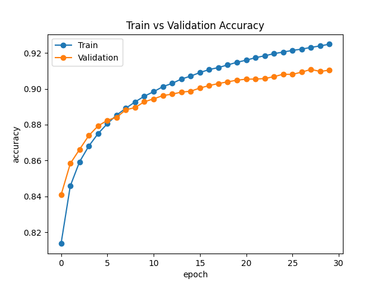
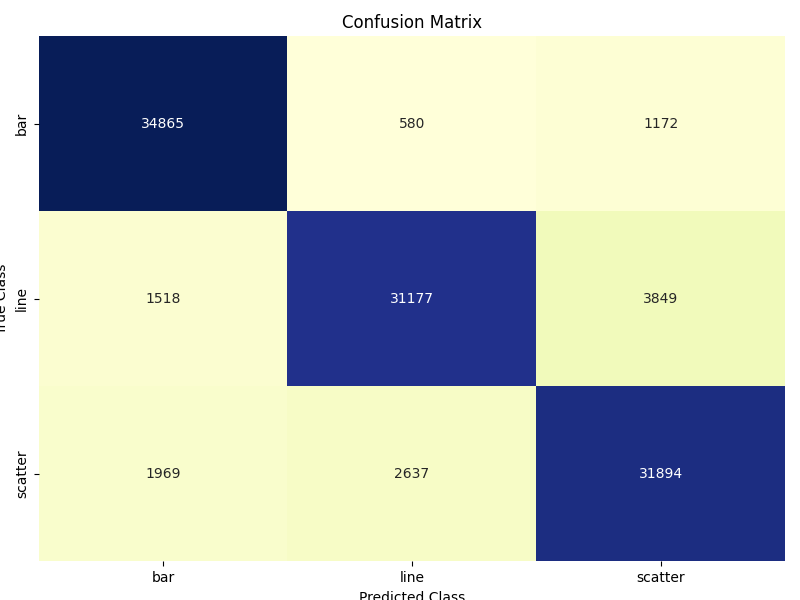
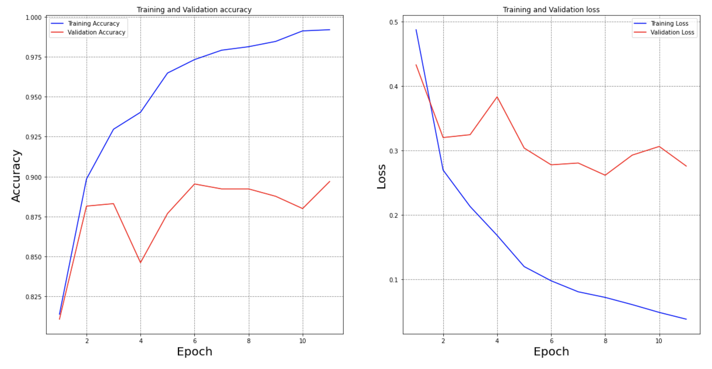
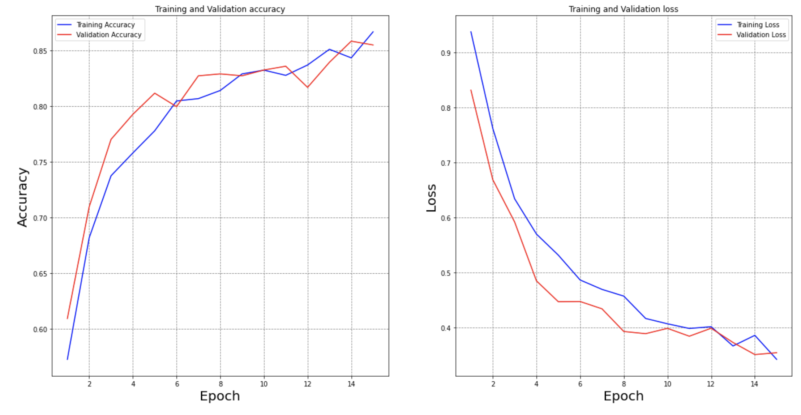
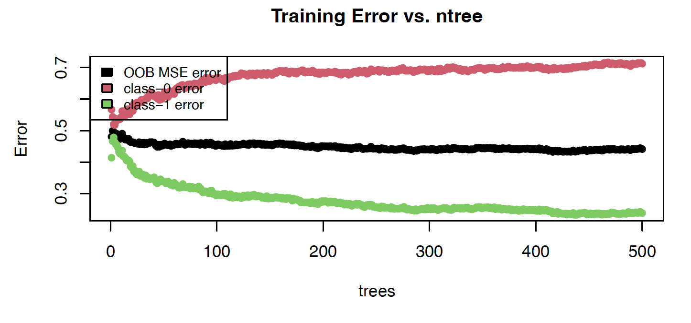
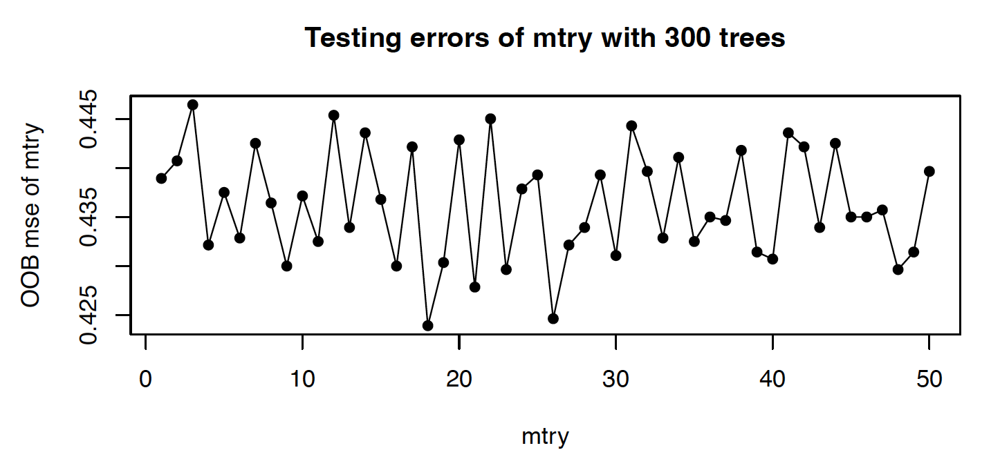
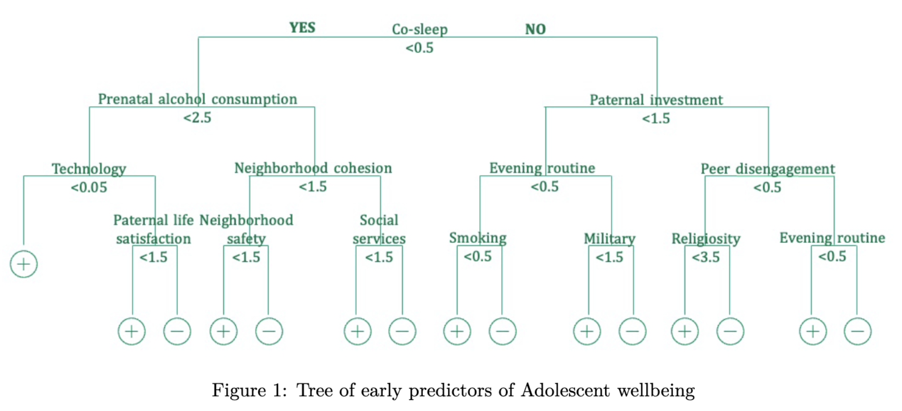
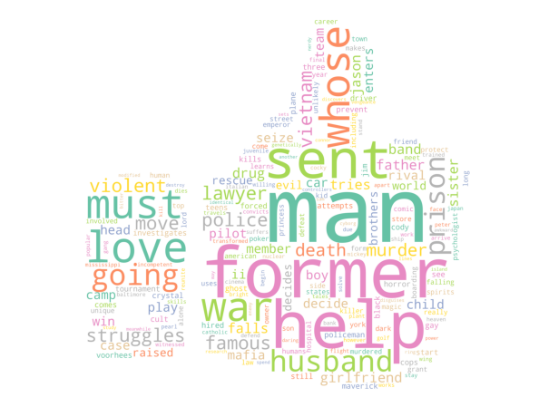
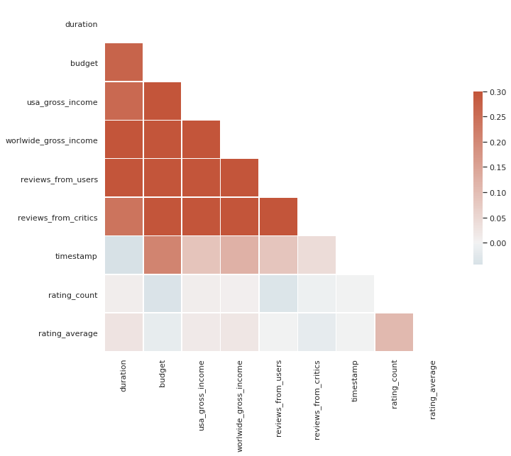
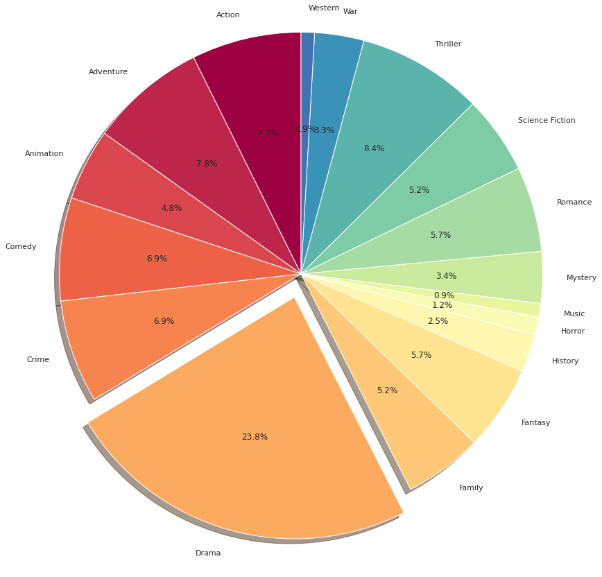

# Hexiang_portfolio
Data Science Portfolio

# [Project 1: Neural Network model for visualization recommendation](https://github.com/hexiangl1020/vizml_NNmodel)

* Established a neural network model to recommend the best chart types for visualization and achieved 92% testing accuracy. 
* This is a three-class classification, representing bar, line and scatter. 
* Returned the best chart type for visualization using machine learning model rather than use rule-based system, which is commonly seen but has many limitations. 
* Feature extraction is an important step here, which translates JSON format data into 846 columns of features by using single-feature extraction, pairwise-feature extraction and aggregation. 

# [Project 2: Covid and Pneumonia X-Ray image classification](https://github.com/hexiangl1020/CoAtNet-covid-19-image-classification)

* Built a CoAtNet model for Covid and pneumonia image classification and solved the problem of overfitting. 
* Lessen the burden of Covid diagnostics for medical system by introducing machine learning models for image classification. 
* A ResNet model was built as a baseline model, with training accuracy of 0.96 and 0.92 of testing accuracy for 15,000 images. The training accuracy is over 0.99 with only 0.89 testing accuracy when we trained only 3,000 images, which indicates a possible overfitting here. 
* A CoAtNet model overcame the problem of overfitting by showing 0.87 training accuracy and 0.85 testing accuracy for only 3,000 images. Since the SageMaker did not support the Tensorflow version we were using, we could not run the whole training data for the CoAtNet model. However the learning curve did not show any sign of overfitting, which indicated a promising result for this model. 

This is the accuracy and loss for Resnet. We can see the overfitting in training data here. 

This is the accuracy and loss for CoAtnet, which is better. 

# [Project 3: Fragile families Case Study](https://github.com/hexiangl1020/fragile_family)
* Since youth wellbeing and mental health raised more concerns nowadays, we chose to buid a model to study what factors are correlated to youth wellbeing.
* We used data from the survey about fragile family and child wellbeing study initiated by Columnbia and Princeton University, which keeps tracking over 5,000 children from their birth till 15-year-old. 
* Our target feature "adolescent wellbeing" was generated by combining their answers to 12 important questions, where higher score indicates positive mental conditions. 
* A few models were constructed and evaluated based on their performances, including linear regression (with or without LASSO regularization), logistic regresstion (with or without LASSO regularization), RandomForest model and a ensemble of all models. 
* The best model we chose based on testing and training was the random forest model. The finial validation error is 0.076. 
* The result revealed that co-sleeping, consistent bedtime routine, household smoking and prenatal alcohol consumption are important features related to youth wellbeing. We may focus on improvement on these factors to preventing long term effects. 

This is the out-of-bag error for the random forest model, which is used to pick the number of trees. 

This is the out-of-bag error for the random forest model with 300 trees, and we want to pick the number of features used for each split. 

# [Project 4: Movie Recommendor system](https://github.com/hexiangl1020/Movie_Recommendor)
* Developed a movie recommendor system using IMDB database which used both collaborative filtering and content-based filtering methods in sklearn.
* Implemented singular value decomposition (SVD) to factorize the movie-rating matrix and used cosine similarities to define the similarities between users.
* Transformed the movie descriptions to features by TF-IDF and measured the cosine similarities between movies.

This is a word cloud of commonly seen words in description of top 500 films. 

This is the correlation plot for features in the cleaned dataframe. 

This pie chart showed the movie genres for top250 films.
